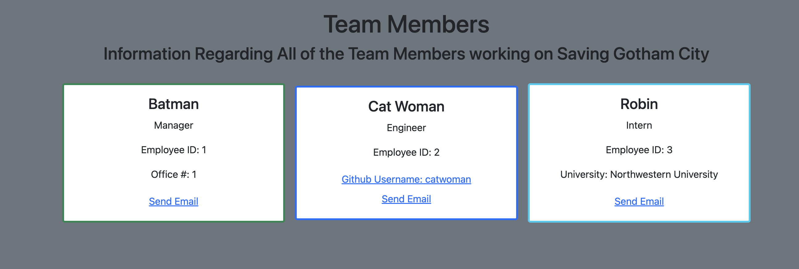

# Team Profile Generator

  ## Table of Contents
  
  - i. [Description](#description)
  - ii. [General Information](#general-information)
    - i. [Installation](#installation)
    - ii. [Usage](#usage)
    - iii. [Contributions](#contributions)
    - iv. [Tests](#tests)
  - iv. [Screenshot](#screenshot)
  - v. [Demo](dDemo)

  ## Description
  
  With this application, you will use Node js to dynamically create a profile of a team in an HTML document. Using the jest module, you will be able to test the functionality of this application. 

  ## General Information
  
  ### Installation
  
  To use my application you must have Node js installed and run the following commands:
  
  ```
  npm init -y
  npm i inquirer@8.2.4
  npm i jest
  ```

  ### Usage 

  Use at your discretion.
  
  ### Contributions

  Please stand by while I go over your changes.
  
  ### Tests

  To run tests on the code, use the following command:

  ```
  npm test
  ```

  **Important Note:** Make sure in your package.json file, under `scripts` you have written:

```
"tests": "jest"
```

This is important to test your code and note that package.json may automatically populate this field with something different. 
 
## Screenshot

Below is a sample screenshot of the application:



## Demo

[Demo Link](https://watch.screencastify.com/v/kkG61Fughk6xOyKgOduQ)